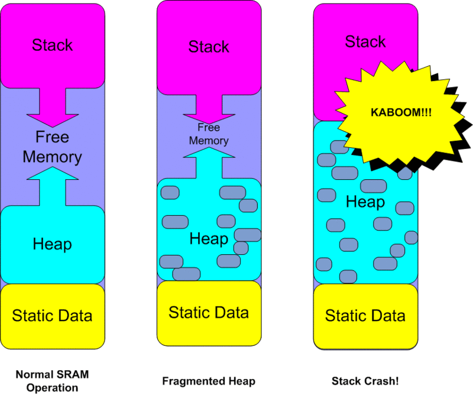

# 学习Arduino内存分配原理

## 1. 起始终止点

- 之前我想当然认为，Arduino SRAM有2048 Bytes内存，所以内存地址是0到2047。

- 但是，我在查阅英文文章之后，发现：

  > Note than in a 328, RAM starts at address 0x100 (256 DEC), and ends at address 0x8FF (2303 DEC).
  >
  > Source：https://forum.arduino.cc/t/trying-to-make-sense-of-ram-usage/622666

- 原来，Arduino内存地址时256到2303。（2303-256=2047，算上256本身刚好2048个格子）

## 2. 头朝上？

- 阅读这篇文章的时候：https://learn.adafruit.com/memories-of-an-arduino/measuring-free-memory，看到这张图：

  

- 错以为：

  - 这张图是从上往下看。
  - Stack Top是从256开始，Stack Bottom不定。
  - Heap Bottom是从2303减去Static Data开始，Heap Top不定。
  - `freeMemory = Heap Top - Stack Bottom`这样子。

- 实际上：

  - **这张图**是**从下往上看**！
  - Static Data从256开始。
  - Heap Top从`( 256 + lengthOf( Static Data ) )`开始，Heap Bottom不定。
  - Stack Bottom从2303开始，Stack Top不定。
  - `freeMemory = Stack Top - Heap Bottom`这样才对。

- 所以，之前的代码写错了。

## 3. 几种不同的Memory获取方式

第一种：来自Adafruit教程：Measuring Memory Usage；链接：https://learn.adafruit.com/memories-of-an-arduino/measuring-free-memory

```C++
#ifdef __arm__
// should use uinstd.h to define sbrk but Due causes a conflict
extern "C" char* sbrk(int incr);
#else  // __ARM__
extern char *__brkval;
#endif  // __arm__

int freeMemory() {
  char top;
#ifdef __arm__
  return &top - reinterpret_cast<char*>(sbrk(0));
#elif defined(CORE_TEENSY) || (ARDUINO > 103 && ARDUINO != 151)
  return &top - __brkval;
#else  // __arm__
  return __brkval ? &top - __brkval : &top - __malloc_heap_start;
#endif  // __arm__
}
```

第二种：来自Arduino官方文档：Arduino Memory Guide里面的SRAM Memory Measurement；链接：https://docs.arduino.cc/learn/programming/memory-guide/

**measure SRAM usage in AVR-based Arduino® boards**:

```C++
void display_freeram() {
  Serial.print(F("- SRAM left: "));
  Serial.println(freeRam());
}

int freeRam() {
  extern int __heap_start,*__brkval;
  int v;
  return (int)&v - (__brkval == 0  
    ? (int)&__heap_start : (int) __brkval);  
}
```

**measure SRAM usage in ARM-based Arduino® boards**:

```C++
extern "C" char* sbrk(int incr);

void display_freeram(){
  Serial.print(F("- SRAM left: "));
  Serial.println(freeRam());
}

int freeRam() {
  char top;
  return &top - reinterpret_cast<char*>(sbrk(0));
}
```

第三种：Arduino Forum 上用户 [RayLivingston](https://forum.arduino.cc/u/RayLivingston) 的帖子：`Trying To Make Sense of RAM Usage....`；链接：https://forum.arduino.cc/t/trying-to-make-sense-of-ram-usage/622666

TA提供了更底层的办法，但是好像他的理解跟我一样有些问题，下面有人纠正TA。无论如何，这是他的代码：

```C++
void showMemory(const char *s)
{
 char __stack = 0;
 
 Serial.println(s);
 Serial.print("__brkval=");
 Serial.println((unsigned int)__brkval);
 Serial.print("__flp=");
 Serial.println((unsigned int)__flp);
 Serial.print("__stack=");
 Serial.println((unsigned int)&__stack);
 Serial.print("stack size=");
 Serial.println(RAM_end - (unsigned int)&__stack);
 Serial.print("Heap size=");
 Serial.println((unsigned int)__brkval - RAM_start);
 
 
 struct __freelist* current;
 int total = 0;
 for (current = __flp; current; current = current->nx)
 {
 total += 2; /* Add two bytes for the memory block's header  */
 total += (int) current->sz;
 Serial.print("mblk: sz=");
 Serial.print((unsigned int)current->sz);
 Serial.print(" nx=");
 Serial.println((unsigned int)current->nx);
 Serial.print("Total: ");
 Serial.println(total);
 }
 Serial.println("\n");
}
```

看完这几种方法，我更迷惑了，好像有很多不同的built-in variable共同declare内存的分布：

```C++
extern int *__brkval;
extern int __malloc_heap_start；
extern int __heap_start;
extern int *__flp;
char __stack = 0; (unsigned int)&__stack;
```

